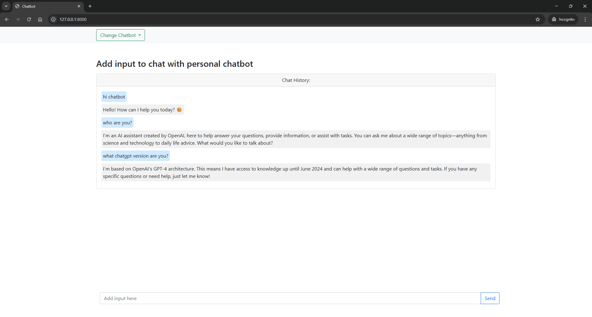
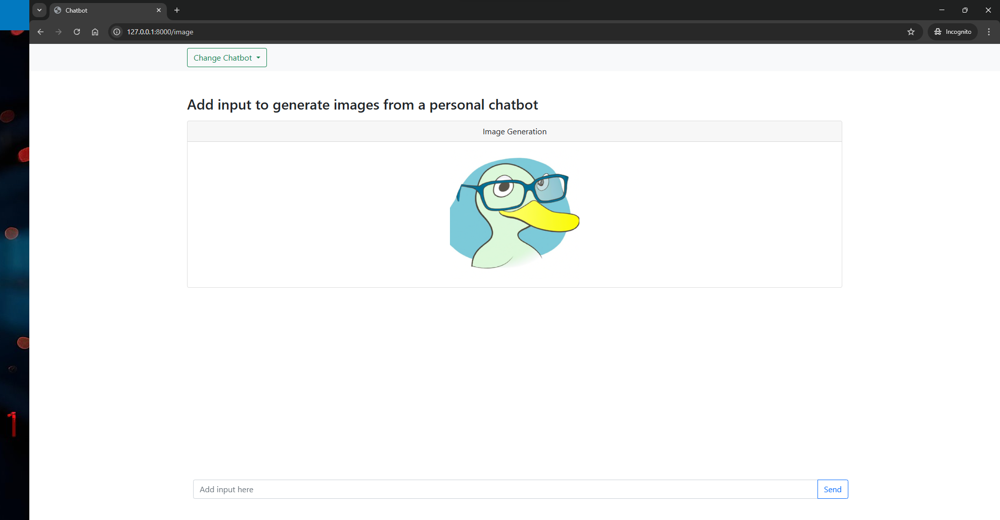

# openai-chatbot
OpenAI chatbot web application to use with OpenAI API key. This web application uses FastAPI, Websocket and Jinja2.





## Prerequisite

Check `requirements.txt` file

## OpenAI API key

Create a file and name it `.env` then paste your OpenAI API key in:
```.env
OPENAI_API_KEY=""
```

## Run application
Run below command to start application locally:
```bash
uvicorn main:app --reload
```

Or deploy if you want.

## Functionalities
- Chat assistant
- Image generation using DALL-E
